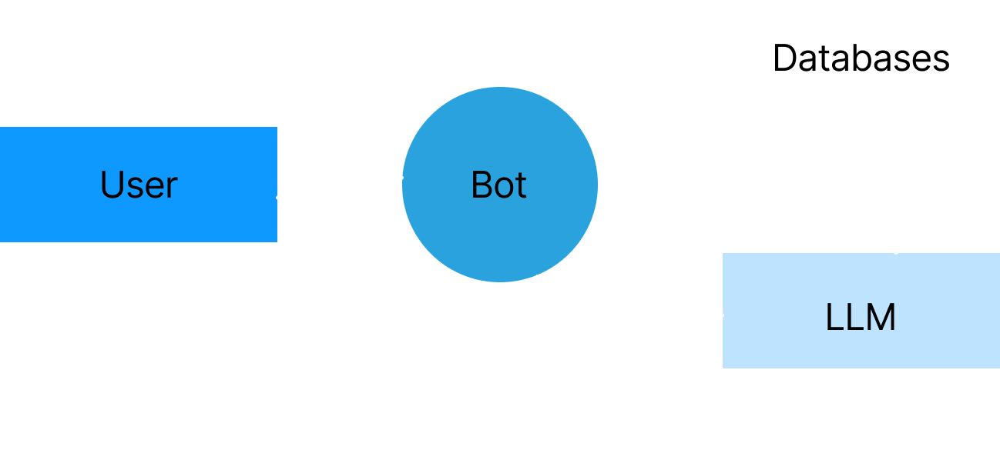
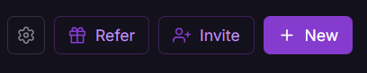
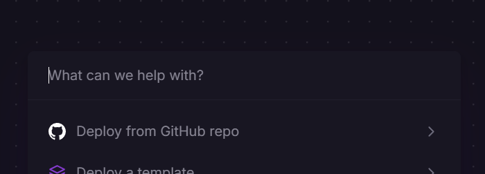
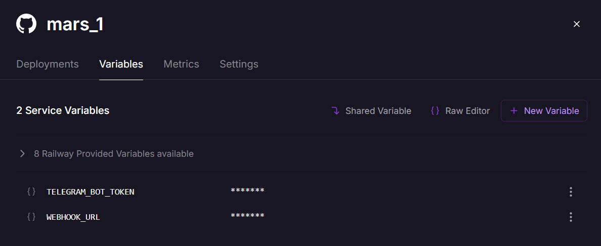
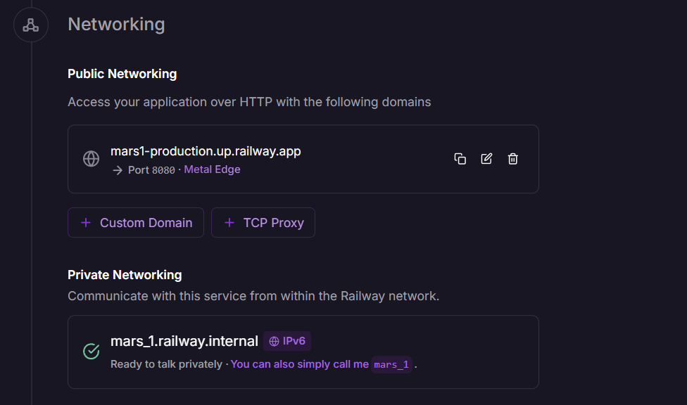

  
  <h1 style="margin: 0;"> A Multi-Agent Conversational Recommender System </h1>

Telegram bot for optimizing the Namazapp app support chat.

[**Up-to-date deployed version**](https://t.me/mvp_1_5_bot)

[**Demo video**](https://drive.google.com/file/d/1pu5FLFF-mL6AW8gWz7RMm9B7M8P0bstP/view)

## Project Goal
#### **Automate the support chat in the app, allowing users to get an answer right away to any question.**

## Project Context Diagram

## Feature Roadmap
- Bot can understand the context ✅
- Bot can understand the app structure ✅
- User can create multiple conversation ✅
- User can ask everything about namaz ✅
- User can send voice messages
- Endpoint for Namaz.app
- Provide the explanation how model work

## Usage instructions
You can use our bot by launching it using the [provided link](https://t.me/mvp_1_5_bot). No further action is required.

# Development
[**Link to the Kanban board**](https://drive.google.com/file/d/1lvN3w-KCPvQyGvFbfXvM-mOQlku4nOV4/view?usp=sharing) or this [**link**](https://drive.google.com/file/d/1SAXZeP9y6pCJRFgHrx-MF7KEN2ItJ8R5/view?usp=sharing), if you have account in Miro 

## Entry criteria

| **TO DO**               | **In progress**       | **In review**               | **Ready to deploy**     | **User testing**       | **DONE**          |
|-------------------------------------|----------------------------------|----------------------------------------|------------------------------------|-----------------------------------|-----------------------------|
| - Discussion problem with team members  - Prioritize among issues  - A performer has been appointed  - A branch has been created in the repository | - Prioritize among issues  - Issues are estimated  - MR has been created | - Code fully implemented and self-reviewed  - Pass all tests  - Branch rebased on main  - min 2 reviewers assigned | - MR is approved  - The documentation is updated  - All tasks for this issue are closed | - Test Environment Ready  - Customer is informed | - Deployment is done  - Documentation is done  - Testing is complete |
  
## Git workflow
All project code you can find in our Github, however the main backlog is on our [Gitlab repository](https://gitlab.pg.innopolis.university/dashboard/issues?sort=created_date&state=opened&assignee_username[]=d.evdokimova)
Our team has several rules of operation:

#### Creating issues from the defined templates
 - We use the templates when creating
 - Try to fill in all the fields in detail and correctly

**Labelling issues**
 - Mark tasks with a label based on the size of the task (S, M, L)
 - Use a label to mark the urgency level of a task and its priority (high, medium, low)
 - Use type labels such as "Task", "Bug" etc

**Assigning issues to team members**
 - Distribute the load evenly (no more than 2-3 L-tasks per person for a sprint)
 - Assign tasks based on a person's specialization
 - The assigned executor is responsible for progress and timely status updates.

**Creating, naming, merging branches**
 - When creating a branch, name it according to its purpose
 - Make sure that name does not match the name of any existing (git branch --list)
 - Merge the branch only after you've tested the code and made sure it works

**Commit messages format**
 - Briefly and clearly describe two things: which file/directory has changed, and what changes have occurred.

### Gitgraph diagram

**Code reviews** _(Pay attention to:)_ 
 - Code clarity
 - Code style
 - Tests (new code should include unit/integration tests, if applicable)
 - Documentation

**Merging pull requests**
 - Minimum 2 approves
 - All tests pass (CI/CD pipeline must be successful)
 - Before merging, you must make sure that there are no conflicts with the main branch.

### Secrets management 
**Rules for secrets management:**
- Do not store secrets in the code, but use environment variables for this purpose when uploading the code somewhere.
- When developing locally, store variables in the .env file to avoid accidentally uploading them to the network.
- Never commit passwords, API keys, tokens, or other secrets directly to a repository (even a private one).

**Resolving issues** 
 - Prioritization: Critical bugs and blockers first, then new features.
 - Time estimation: If a task takes longer than planned, inform the team in advance.

# Build and deployment

## Deployment instructions
The **_Railway_** service is used to deploy our project. To repeat the project deployment, you can follow these steps:
1. Register or log in to your Railway account
2. Click to button to deploy new project 

3. And choose project to deploy from the Github

4. Add enviroment variables:

-4.1 Set your bot token
-4.2 Set webhook URL. You can find it in Settings -> Networking section

5. Deploy project and make adjustments according to the logs

## Continuous Integration

Our project uses two separate CI pipelines: one for the database connector and one for the bot.

#### Database connector CI

- **CI Workflow:** [`.github/workflows/test.yml`](https://github.com/hermitdesu/SWP_DB/blob/main/.github/workflows/test.yml)

- **Static Analysis and Testing Tools Used:**
  - **pytest:** Runs automated tests to verify code correctness.
  - **flake8:** Ensures code style consistency and catches simple errors.
  - **bandit:** Scans the codebase for security vulnerabilities.

- **Where to See CI Workflow Runs:**  
  You can view all connector CI workflow runs for this project here:  
  [GitHub Actions Runs](https://github.com/hermitdesu/SWP_DB/actions)

---

#### Bot CI

- **CI Workflow:** [`bot_aio/.github/workflows/test.yml`](https://github.com/Black-persik/bot_aio/blob/tests/.github/workflows/test.yml)

- **Static Analysis and Testing Tools Used:**
  - **flake8:** Ensures code style consistency and catches both critical and stylistic errors.
  - **mypy:** Checks for type errors and enforces type safety.
  - **pytest:** Runs automated tests to verify code correctness.

- **Where to See CI Workflow Runs:**  
  You can view all bot CI workflow runs for this project here:  
  [GitHub Actions Runs](https://github.com/Black-persik/bot_aio/actions)

## Quality assurance

### Automated tests

- **Tools used for testing:**  
  - `pytest` — the main framework for unit and integration tests in all parts of the project  
  - `pytest-asyncio` — for testing asynchronous code  
  - `unittest` and `unittest.mock` — for integration tests and mocking the database in the backend  

- **Tests that we implemented:**  
  - **Unit tests:**  
    - In the database connector repository:
      - Mock tests for user CRUD operations
      - Mock tests for conversation CRUD operations
      - Mock tests for log CRUD operations
      - Tests for user models
      - Tests for conversation models
      - Tests for log models
    - In the bot repository:
      - `test_start_new_user_unit`: Checks that the start function correctly handles a new user and prompts for a name.
      - `test_start_existing_user_unit`: Checks that the start function correctly handles an already registered user and ends the conversation.
      - `test_get_name_unit`: Verifies that the get_name function saves the user’s name and ends the conversation.
      - `test_cancel_unit`: Ensures the cancel function sends a cancellation message and ends the conversation.
      - `test_help_command_unit`: Checks that the help_command function sends the help message.
  - **Integration tests:**  
    - In the database connector repository:
      - Tests for user API endpoints
      - Tests for conversation API endpoints
      - Tests for log API endpoints
      - Tests for root and health endpoints
    - In the bot repository:
      - `test_full_registration_and_ask_integration`: Simulates a full registration flow and ensures the name is saved.
      - `test_ask_and_ask_handler_integration`: Simulates asking a question and getting a response from the model.
      - `test_cancel_clears_conv_id_integration`: Ensures that cancelling a conversation removes the conversation ID from the user’s context.
      - `test_start_network_error_integration`: Checks that the start function gracefully handles network errors.
      - `test_get_name_network_error_integration`: Checks that the get_name function gracefully handles network errors.

- **Where tests of each type are in the repository:**  
  - In the database connector repository:  
    - All tests are located in the `tests/` directory:
      - Unit tests:  
        - `tests/test_cruds_mock.py`  
        - `tests/test_models_user.py`  
        - `tests/test_models_conv.py`  
        - `tests/test_models_log.py`
      - Integration tests:  
        - `tests/test_api_integration.py`
    - You can see the full test suite [here](https://github.com/hermitdesu/SWP_DB/tree/main/tests).

  - In the bot repository:  
    - All tests are located in the `tests/test_all.py` file.  
    - You can see the full test suite [here](https://github.com/Black-persik/bot_aio/blob/tests/tests/test_all.py).
  
### Quality attribute scenarios
Description of quality scenarios: [docs/quality-assurance/quality-attribute-scenarios.md](docs/quality-assurance/quality-attribute-scenarios.md)

